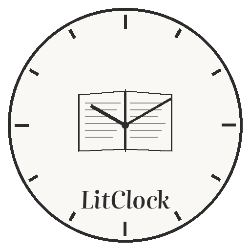
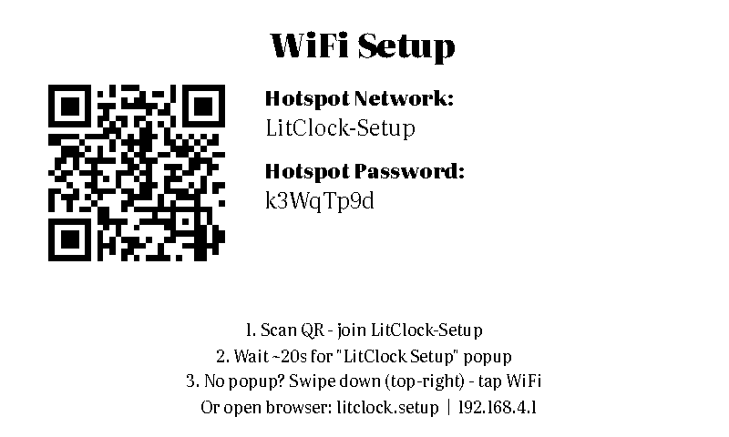
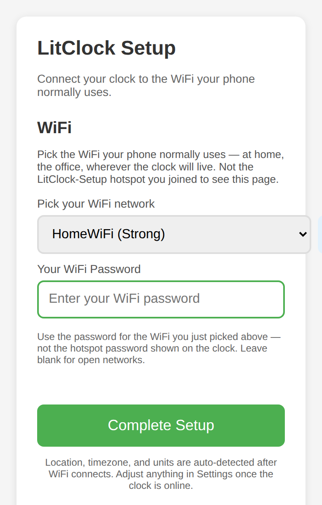
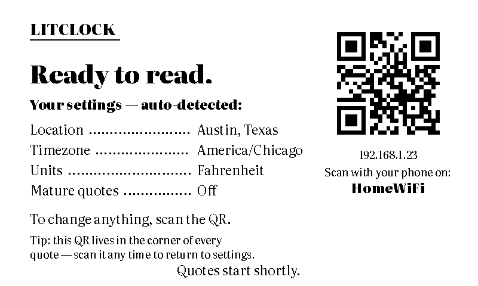
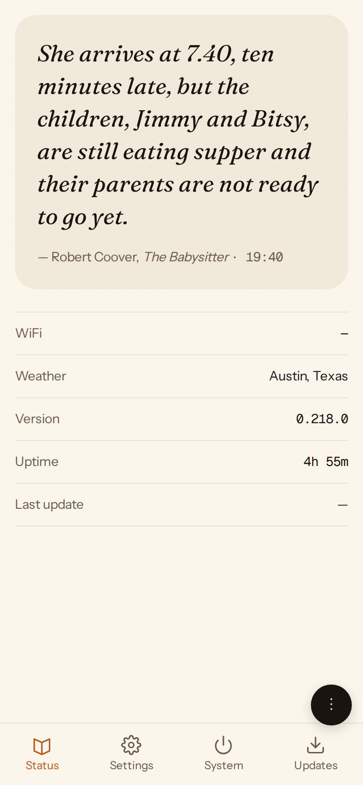
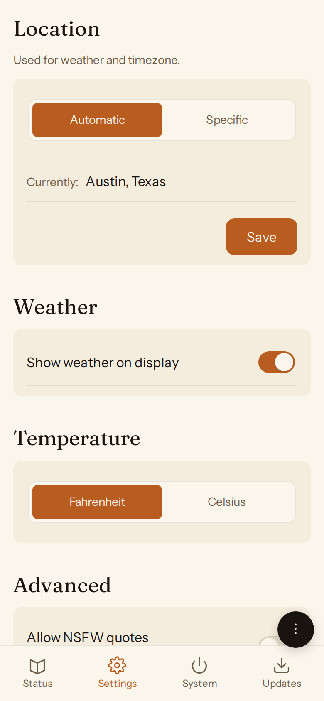
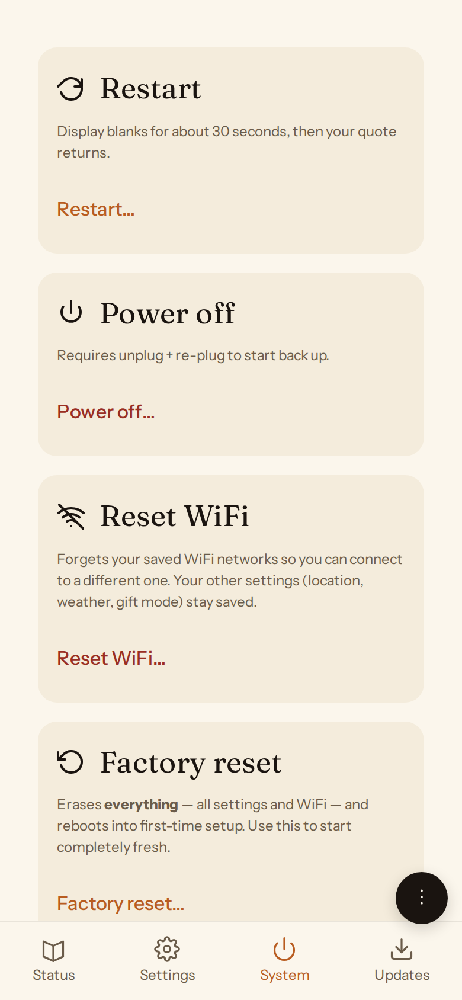

<p align="center">
  
</p>

<h1 align="center">LitClock</h1>

<p align="center">
  <a href="https://github.com/kapoorankush/litclock/actions/workflows/lint.yml"></a>
  <a href="https://github.com/kapoorankush/litclock/actions/workflows/build-image.yml"></a>
  <a href="https://github.com/kapoorankush/litclock/releases/latest"></a>
  <a href="LICENSE"></a>
  <a href="https://www.python.org/"></a>
  <a href="https://www.raspberrypi.com/"></a>
</p>

<p align="center">A Raspberry Pi Zero 2 W with a Waveshare 7.5" e-Paper display (800x480) that shows the time using 4,800+ curated literary quotes, one for every minute of the day, along with the date and weather.</p>


### One-minute tour


## Philosophy

LitClock is built for people who want a literary clock on their wall and never want to think about it again. It is not an SSH-optional developer tool. If you are a non-technical user, you should not need to do anything after first boot: setup is a one-time "join the hotspot, pick your WiFi" step, and everything else — location, timezone, temperature units — configures itself. If you are a technically comfortable user, you can enable SSH (it ships off — see [Recovering a LitClock](docs/recovery.md)) and disable or customize any of this. **The defaults are the product.**

That's why the clock updates its own software quietly on a weekly schedule (see [Updating](#updating)), and why day-to-day control happens from a phone — a small web app served by the clock itself — rather than a terminal.

## Credits

This project was originally forked from [jadonn/literary-clock](https://github.com/jadonn/literary-clock) and has since been extensively rewritten. The literary clock concept originates from [Jaap Meijers's Instructables project](https://www.instructables.com/Literary-Clock-Made-From-E-reader/) (2018).

**Code & display inspiration:**
- [Jake Krajewski's Raspberry Pi + e-Paper Tutorial](https://medium.com/swlh/create-an-e-paper-display-for-your-raspberry-pi-with-python-2b0de7c8820c)
- [Mendhak's Waveshare e-Paper Display](https://github.com/mendhak/waveshare-epaper-display) (MIT)

**Quote database sources:**
- [JohannesNE/literature-clock](https://github.com/JohannesNE/literature-clock) (CC BY-NC-SA 2.5)
- [cdmoro/literature-clock](https://github.com/cdmoro/literature-clock) (MIT)
- [The Guardian "Books blog" reader thread](https://www.theguardian.com/books/booksblog/2011/apr/21/literary-clock) — community-sourced time-referential quotes from the 2011–2018 reader comments

**Case design:**
- [Arthur Gassner's Time Teller](https://github.com/arthurgassner/timeteller) (CC BY) — the 3D-printed case; lightly modified STLs ship in [`3d-models/`](3d-models/) (see [Hardware Assembly](docs/hardware-assembly.md))

**Assets:**
- [Dhole's Monochrome Weather Icons](https://github.com/Dhole/weather-pixel-icons) (CC BY-SA 4.0)
- [Google Fonts](https://fonts.google.com) — Literata (OFL 1.1)

See [NOTICE.md](NOTICE.md) for full license details on third-party components.

> LitClock was developed privately before this repository was published, so issue/PR numbers referenced in the [CHANGELOG](CHANGELOG.md) predate the public issue tracker.

## Hardware

Raspberry Pi Zero 2 W + [Waveshare 7.5" e-Paper HAT (V2)](https://www.amazon.com/dp/B075R4QY3L) (800×480, SPI — [product page](https://www.waveshare.com/7.5inch-e-paper-hat.htm)). Print-ready case STLs are included in [`3d-models/`](3d-models/) (Arthur Gassner's CC BY Time Teller design, lightly modified). For the full parts list, assembly steps, and case instructions, see **[Hardware Assembly](docs/hardware-assembly.md)**.

## Installation

### Option 1: Download Image (Recommended)

The easiest way to get started — no terminal or technical knowledge required.

1. Download the latest `.img.xz` from **[Releases](https://github.com/kapoorankush/litclock/releases/latest)**
2. Flash it to a microSD card using [Raspberry Pi Imager](https://www.raspberrypi.com/software/) or [balenaEtcher](https://etcher.balena.io/)
3. Insert the SD card and power on the Pi
4. The e-ink display shows a **"LitClock-Setup"** hotspot with its password and a QR code. Join it from your phone — the setup page opens automatically (or browse to the address shown on the display).
5. Pick your home WiFi network, enter its password, and submit. **That's the whole form** — location, timezone, and temperature units are detected automatically once the clock is online.
6. The display shows a "Ready to read." summary with a QR code to the clock's control app. Scan it, tap **"Done — Start the Clock"** (or just wait — the clock starts on its own a couple of minutes later), and optionally add the app to your home screen.

Here's the whole sequence — one form, everything else automatic:

<table>
  <tr>
    <td align="center"><b>1.</b> The clock shows its setup hotspot + QR</td>
    <td align="center"><b>2.</b> Your phone joins; the portal opens — pick your WiFi</td>
  </tr>
  <tr>
    <td align="center"></td>
    <td align="center"></td>
  </tr>
  <tr>
    <td align="center"><b>3.</b> The clock joins your WiFi and auto-detects your location</td>
    <td align="center"><b>4.</b> "Ready to read." — scan the QR for the control app</td>
  </tr>
  <tr>
    <td align="center"></td>
    <td align="center"></td>
  </tr>
</table>

Anything the auto-detection got wrong — city, units, mature-content filter — takes a few taps to fix in the app's Settings tab.

**Prefer paper?** Print the **[quick-start booklet](docs/manual/)** — a one-sheet, fold-in-half guide covering the same steps ([A4](docs/manual/litclock-manual-A4-booklet.pdf) / [US Letter](docs/manual/litclock-manual-Letter-booklet.pdf)). It's written for non-technical recipients and makes a nice enclosure when the clock is a gift.

### Option 2: DIY Installation (Terminal Required)

If you prefer to install on an existing Raspberry Pi OS setup:

1. Flash Raspberry Pi OS Lite to your SD card
2. SSH into the Pi (or connect keyboard/monitor)
3. Run the installer:

```bash
curl -sSL https://raw.githubusercontent.com/kapoorankush/litclock/master/scripts/install.sh | bash
```

The installer will:
- Install system dependencies and BCM2835 driver
- Enable SPI interface and NTP time sync
- Detect Pi Zero W/Zero 2 W and offer WiFi stability fixes (see below)
- Clone the repository to `/home/pi/litclock`
- Download the current quote-image set (~130 MB) from the pinned [GitHub Release](https://github.com/kapoorankush/litclock/releases). Requires network at install time; the clock still runs if the download fails but will fall back to a time-only display until the images are fetched.
- Set up Python virtual environment with required packages
- Install systemd services for the boot splash, shutdown splash, first-boot provisioning, the control app, the self-updater, and the once-per-minute clock timer

After installation, reboot. The display will guide you through the same WiFi setup as Option 1.

### Option 3: Pre-configured SD Card

If you received a pre-configured SD card (e.g., from a friend or family member), just insert it and power on — the setup flow is the same as Option 1, step 4.

To create pre-configured SD cards for others, see [Creating SD Cards for Friends & Family](docs/sd-card-cloning.md).

To build your own image from source, see [Building the Image](docs/building-image.md).

### WiFi Stability (Pi Zero W / Zero 2 W)

The Raspberry Pi Zero W and Zero 2 W have a known WiFi stability issue with the BCM43430 chip that can cause the system to hang and become unreachable. The installer detects this hardware and offers to apply stability fixes:

- **Driver parameters**: Disables roaming and problematic power features
- **Power management**: Disables WiFi power saving
- **Watchdog**: Automatically reboots if WiFi becomes unreachable

If you experience WiFi disconnections or system hangs, re-run the installer or manually apply the fixes described in [issue #8](https://github.com/kapoorankush/litclock/issues/8).

## The Control App

Every LitClock serves a small web app on your home network at **`http://litclock.local`** (or the clock's IP — the QR code at the end of setup points there). Open it in any browser, or add it to your phone's home screen for one-tap access. No account, no cloud — the app is served by the clock itself and works only on your LAN.

| Tab | What it does |
|-----|--------------|
| **Status** | Current quote, weather, WiFi, and version at a glance |
| **Settings** | Location (automatic by IP, or type any place worldwide), weather on/off, Fahrenheit/Celsius, mature-content filter |
| **Updates** | Current version, release notes, and a button to apply an update now |
| **System** | Restart, power off, reset WiFi, factory reset, and "Prepare for Gifting" |
| **Diagnostics** | Read-only health panel: last render, network, services, recent logs, and a downloadable support-log bundle |

<p align="center">
  
  
  
</p>

## Configuration

Weather works out of the box — no signup, no API key. The clock uses [Open-Meteo](https://open-meteo.com) as its default forecast provider, and location, timezone, and units are auto-detected from your internet connection during setup. Day-to-day changes (city, units, mature-content filter) are made in the control app's **Settings** tab. That's the whole configuration.

Under the hood, settings live in `/home/pi/litclock/env.sh`. You only need to touch this file on a DIY install or for the advanced options below:

```bash
# Weather location (written by setup / the control app; override here if you want)
export WEATHER_LATITUDE=30.27
export WEATHER_LONGITUDE=-97.74
export WEATHER_UNITS=imperial

# Quote content
export ALLOW_NSFW_QUOTES=false

# Weather cache duration in seconds (default: 3600)
export WEATHER_TTL=3600

# Optional: use OpenWeatherMap instead of the default Open-Meteo (leave blank for Open-Meteo)
# export OPENWEATHERMAP_APIKEY=
```

| Variable | Description |
|----------|-------------|
| `WEATHER_LATITUDE` | Location latitude (set by setup / the app; see "Overriding location coordinates" below) |
| `WEATHER_LONGITUDE` | Location longitude (set by setup / the app; see "Overriding location coordinates" below) |
| `WEATHER_UNITS` | `imperial` (Fahrenheit) or `metric` (Celsius) |
| `ALLOW_NSFW_QUOTES` | Show quotes with mature content (default: `false`) |
| `WEATHER_TTL` | Weather cache duration in seconds (default: `3600`) |
| `OPENWEATHERMAP_APIKEY` | Optional — use OpenWeatherMap instead of Open-Meteo (see "Advanced: using OpenWeatherMap" below) |

### Advanced: using OpenWeatherMap instead of Open-Meteo

By default the clock uses Open-Meteo, which is free and requires no signup. If you'd rather use OpenWeatherMap (for example, you already have a key or prefer its forecast model):

1. Sign up for a free account at [OpenWeatherMap](https://openweathermap.org/) and grab a key from [API Keys](https://home.openweathermap.org/api_keys).
2. Edit `/home/pi/litclock/env.sh` and set `OPENWEATHERMAP_APIKEY=your_key_here`.
3. Restart the timer: `sudo systemctl restart litclock.timer`.

The OpenWeatherMap free tier allows 1,000 calls per day; the clock caches forecasts for an hour by default, so usage stays well within limits.

### Advanced: overriding location coordinates

The control app's Location setting handles geocoding for most users (it accepts city names, postal codes, and has an Advanced panel for raw coordinates). If you'd rather edit the file directly — for example on a DIY install — set `WEATHER_LATITUDE` and `WEATHER_LONGITUDE` in `env.sh`.

Finding coordinates:

- **Google Maps**: right-click your location; the coordinates appear at the top of the menu (e.g., "30.27, -97.74"). Latitude first, longitude second.
- **[latlong.net](https://www.latlong.net/)**: search an address and copy the values.
- **iPhone**: open the Compass app; coordinates are at the bottom.
- **Android**: long-press your location in Google Maps; coordinates appear at the top.

## Manual Run

```bash
cd /home/pi/litclock
./scripts/runtheclock.sh
```

## Updating

**Short version:** you don't need to do anything. The clock updates itself.

### Updates

LitClock pulls the latest blessed release **once a week, Sunday 03:00 local time, with up to 7 days of randomization** so the fleet doesn't all update at the same moment. Each device rolls its own offset in the [0s, 7d] window — most devices pick up a new release within 1–7 days of it being cut. You can also apply an update immediately from the control app's **Updates** tab.

What updates automatically:
- LitClock code (clock logic, control app, setup server, shell scripts)
- Python packages in the venv
- systemd units (new timers/services are auto-enabled)
- `env.sh` — **new** variables from `env.sh.sample` are merged in; your existing values are preserved
- Quote images, pinned by `.images-version`

What does NOT update automatically — **by design**:
- OS packages (`apt upgrade`) and Raspberry Pi firmware. On the flashed image, OS auto-updates are explicitly disabled: a surprise apt upgrade could break the display stack with nobody at the keyboard. OS-level updates happen when you flash a newer image (or run them yourself over SSH).

Two safety nets protect every update:
- A **pre-wiring smoke test**: after rebuilding the venv, the updater renders an in-memory quote image. If the render fails, the update reverts to the previous SHA before touching the running clock. If that happens, a subtle "!" glyph appears in the top-right corner of the clock face until the next successful update.
- A **boot check with automatic rollback**: if the clock ever boots and can't paint a quote, it retries, and after repeated failures automatically reinstalls the last release that is known to have painted. A bad update can't brick a clock that has no keyboard and no SSH.

### Manual update (optional)

Use the control app's **Updates** tab, or from a shell:

```bash
/home/pi/litclock/scripts/update.sh
```

Non-interactive and idempotent. Stops the timer, resolves the latest blessed release SHA (via the GitHub Releases API), pulls, rebuilds the venv if requirements changed, smoke-tests the render, re-applies systemd units, refreshes the display, and restarts the timer. Your `env.sh` configuration is preserved; any new env vars from `env.sh.sample` are merged automatically.

### Inspection

Check when the timer last fired and its next scheduled run:

```bash
systemctl status litclock-update.timer
```

See the logs of the last update attempt:

```bash
journalctl -u litclock-update.service --since "1 week ago"
```

### Opt-out

If you'd rather manage updates yourself, disable the timer via SSH:

```bash
sudo systemctl disable --now litclock-update.timer
```

The clock keeps working on whatever SHA it's pinned to. The `scripts/update.sh` script and the app's Updates tab still work for manual runs. You can re-enable the timer later with:

```bash
sudo systemctl enable --now litclock-update.timer
```

The update installer respects a manually-disabled timer — it won't silently re-enable it.

### Fresh image

For a fresh image, use the downloadable `.img.xz` (Option 1 above) — the installer and update script are only for existing Raspberry Pi OS installations.

## Creating SD Cards for Friends & Family

The control app's **System → Prepare for Gifting** wipes your WiFi, writes an optional welcome message, and powers the clock down ready to box up. Print the **[quick-start booklet](docs/manual/)** to enclose with it. To duplicate SD cards instead, see **[SD Card Cloning](docs/sd-card-cloning.md)**.

## How It Works

On boot, the clock goes through this sequence:

1. **Splash screen** — "LitClock / Starting..." shown on the e-ink display
2. **First-boot setup** (first time only) — the Pi creates the "LitClock-Setup" hotspot and shows joining instructions on the e-ink. After you submit your WiFi, it connects, auto-detects location/timezone/units by IP geolocation, and shows the "Ready to read." handoff screen with a QR code to the control app.
3. **Clock timer** — updates the display at the top of every minute with a new literary quote
4. **Control app** — served continuously on your LAN at `http://litclock.local`

The Pi has no hardware clock, so NTP time sync is enabled automatically during installation and first boot to ensure accurate time after every power cycle.

This is managed by systemd services — the important ones:

| Service | Purpose |
|---------|---------|
| `litclock.timer` / `litclock.service` | Renders a quote to the display every minute at :00 |
| `litclock-control.service` | Serves the control app on port 80 |
| `litclock-splash.service` | Shows the welcome splash on every boot |
| `litclock-firstboot.service` | Runs first-boot setup (disables itself after) |
| `litclock-update.timer` / `.service` | Weekly self-update |
| `litclock-lkg.service` / `litclock-bootcheck.service` | Record the last release that painted; auto-rollback if a boot can't paint |
| `litclock-reresolve-location.service` | Re-checks IP geolocation on boot (Automatic location mode only) |
| `litclock-shutdown.service` | Displays a shutdown splash on poweroff/halt |
| `wifi-watchdog.timer` / `.service` | Reboots the Pi if WiFi becomes unreachable (Pi Zero W stability fix) |

Useful commands:
```bash
# Check timer status and next trigger
systemctl status litclock.timer

# View clock update logs
journalctl -u litclock.service -f

# Manually trigger a display update
sudo systemctl start litclock.service
```

## Script Reference

For a full list of scripts and their usage, see **[Script Reference](docs/script-reference.md)**.

## Resetting the Clock

Most resets don't need a shell — use the control app's **System** tab:

- **Reset WiFi** — forget saved networks and return to the setup hotspot (settings and quote history are kept)
- **Factory reset** — wipe all settings and start over from the first-boot experience
- **Prepare for Gifting** — wipe WiFi, write a welcome message for the recipient, and power off ready to box up

From a shell, the equivalent is:

```bash
sudo ./scripts/reset-setup.sh
sudo reboot
```

Flags:
- `--yes` — skip the confirmation prompt
- `--reboot` — reboot automatically after reset
- `--wipe-wifi` — also delete saved WiFi networks (full fresh-flash simulation)
- `--gift-mode` — prepare for shipping: wipes WiFi, paints a welcome splash on the e-ink, and powers off. When the recipient first plugs in the device, they see a friendly welcome and setup steps instead of "Powered Off". Implies `--wipe-wifi --yes`.

For a full reset (including WiFi) for cloning SD cards, use `scripts/prepare-for-cloning.sh` instead (see [SD Card Cloning](docs/sd-card-cloning.md)).

## Troubleshooting

**Start here (no shell needed):** open the control app (`http://litclock.local`) → **Diagnostics** tab. It shows version, last render time, WiFi + weather status, error flags, and recent logs — everything below, without SSH. Screenshot it, or use "Download full logs" to export a redacted support bundle safe to attach to an issue.

- **Wrong city, units, or timezone**: fix it in the app → Settings. If setup couldn't detect your location at all (some networks block IP geolocation), the app offers a one-tap "use my browser's timezone" fallback so the clock runs correctly with weather off.
- **Display not updating**: Check SPI is enabled with `ls /dev/spi*`
- **Check service status**: `systemctl status litclock.timer`
- **View service logs**: `journalctl -u litclock.service --since today`
- **Force weather update**: `rm /home/pi/litclock/weather-cache*.json`
- **WiFi disconnects (Pi Zero)**: Re-run installer and accept WiFi stability fixes, or check `dmesg | grep brcmfmac` for errors
- **WiFi fails during setup**: The setup page shows an error banner and lets you fix the password and resubmit. If it keeps failing, restart the Pi closer to your router.
- **Start setup over**: app → System → Factory reset, or `sudo ./scripts/reset-setup.sh && sudo reboot` from a shell
- **Clock stuck, or you need a shell**: SSH ships **off**. See **[Recovering a LitClock](docs/recovery.md)** for getting a shell via the console, enabling SSH from the SD card, resetting to first-boot, and the read-only Diagnostics tab.

For hardware issues, refer to the [Waveshare wiki](https://www.waveshare.com/wiki/7.5inch_e-Paper_HAT) and [demo repository](https://github.com/waveshare/e-Paper).

## Disclaimer

LitClock is a hobbyist, open-source project provided free of charge and released under the [MIT License](LICENSE).

**THE SOFTWARE IS PROVIDED "AS IS", WITHOUT WARRANTY OF ANY KIND, EXPRESS OR IMPLIED**, including but not limited to warranties of merchantability, fitness for a particular purpose, non-infringement, or that the software is free of defects, errors, or vulnerabilities.

By downloading, flashing, building, modifying, or otherwise using LitClock, its pre-built images, or any associated scripts or documentation, you acknowledge and agree that:

- **You use it entirely at your own risk.** The authors, contributors, and copyright holders shall not be liable for any claim, damages, or other liability, whether in contract, tort, or otherwise, arising from or in connection with the software or its use. This includes, without limitation: damage to hardware (Raspberry Pi, e-Paper display, SD cards, power supplies, or other connected equipment), data loss, network-related issues, fire, electrical damage, property damage, personal injury, or any indirect, incidental, special, consequential, or punitive damages.
- **No support is guaranteed.** Bug reports and pull requests are welcome but responses, fixes, and continued maintenance are entirely at the maintainer's discretion.
- **Third-party services and content are out of scope.** LitClock integrates with third-party services (e.g., Open-Meteo, OpenWeatherMap, IP geolocation providers) and displays literary quotes derived from public sources. The maintainer is not responsible for the availability, accuracy, licensing, or content of any third-party service or quote corpus. You are responsible for complying with the terms of any service you enable and for ensuring your use of any included content is lawful in your jurisdiction.
- **Not fit for safety-critical, commercial, or production use.** LitClock is designed as a novelty clock for personal, non-commercial use. It must not be relied upon for timekeeping, scheduling, safety, medical, industrial, or any other purpose where failure could cause harm or loss.
- **Trademarks, copyrights, and attributions** for any quoted works, referenced products, or third-party libraries remain the property of their respective owners. Inclusion does not imply endorsement.

If you do not agree with these terms, do not install or use the software.
